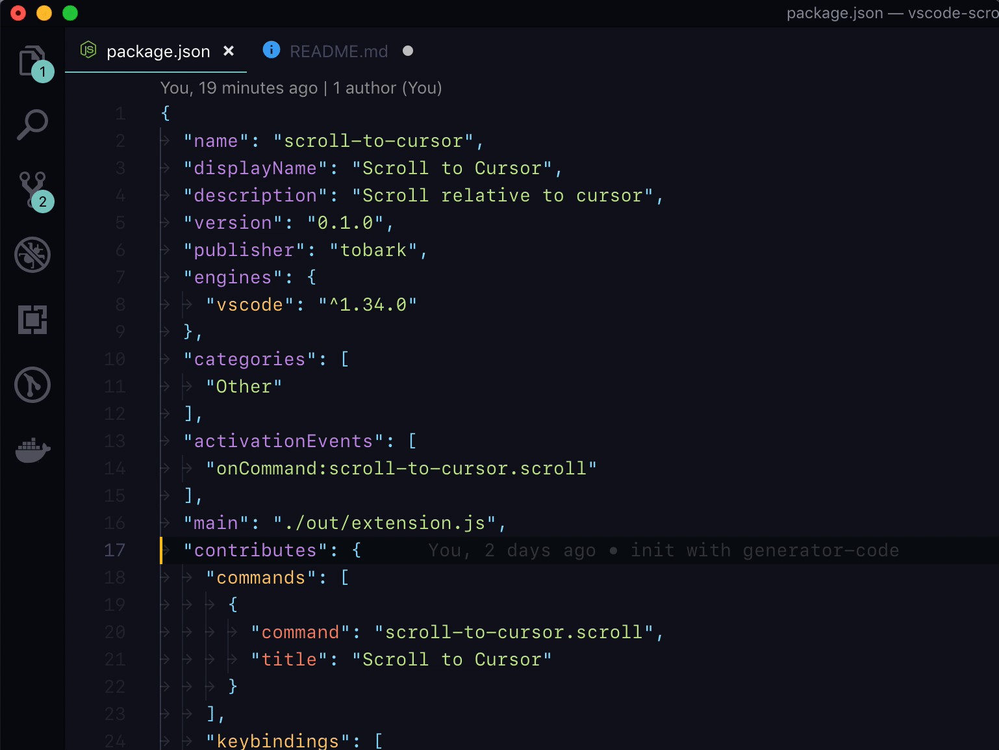

# Scroll to Cursor

Scroll to the cursor(caret). Shortcut is `Ctrl+L`.

## Features

## Extension Settings

This extension contributes the following settings:

* `scrollToCursor.offset`: Number of lines you want to leave on top of the page

## Release Notes

### 0.1.0

Initial release
